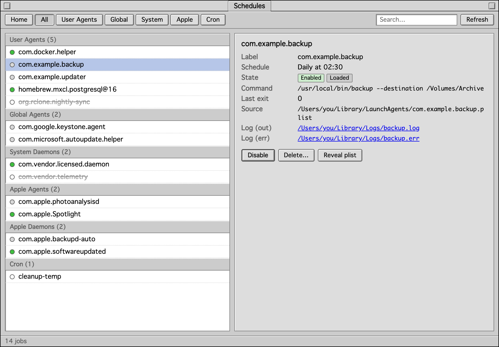
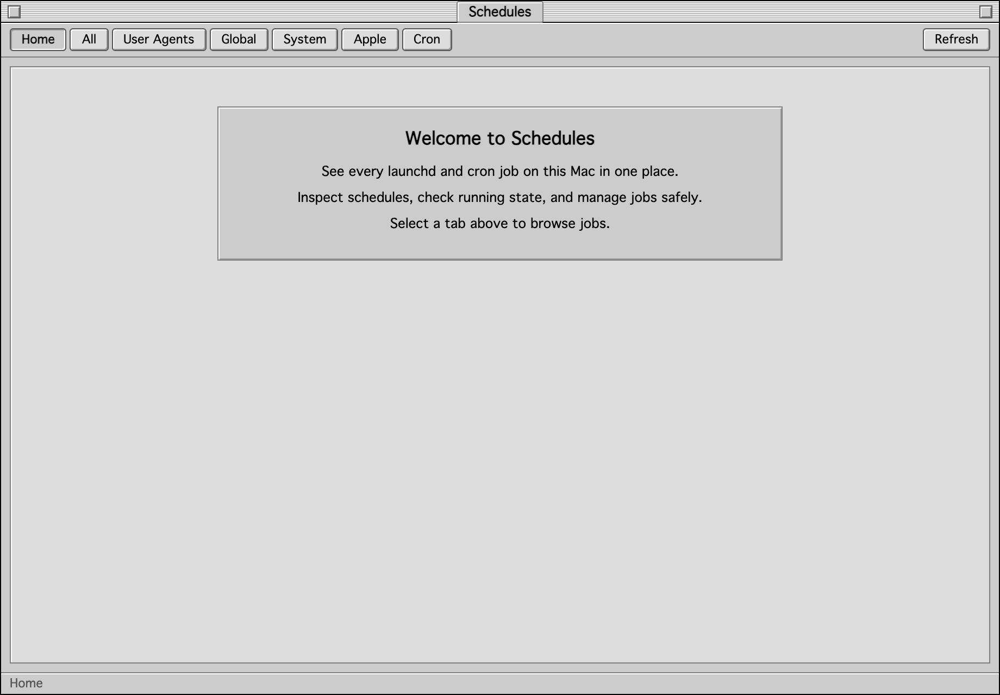
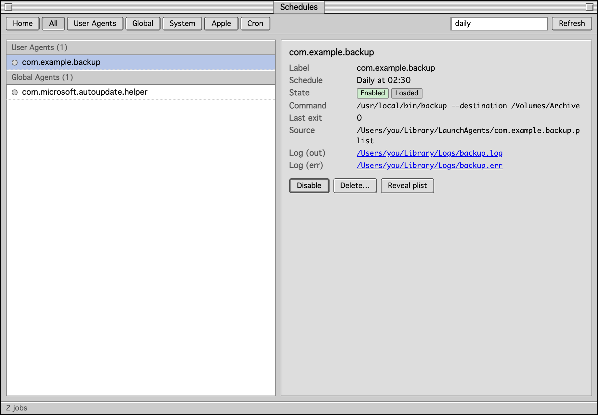
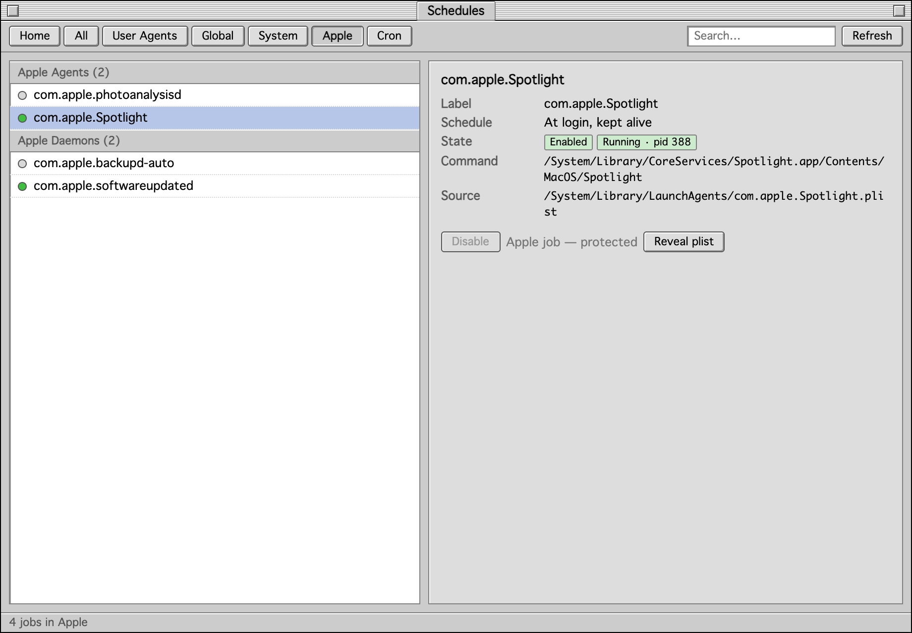
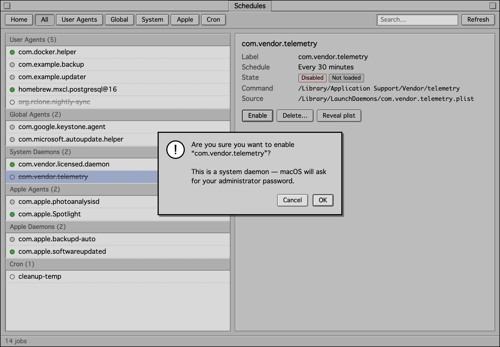

<div align="center">

# Schedules

**See everything your Mac runs behind your back — in a 1999 interface.**

Your Mac quietly runs dozens of background jobs: updaters, sync tools, helpers
left behind by apps you deleted years ago. macOS gives you no proper way to look
at them. This app does, dressed in classic Mac OS 8/9 "Platinum".



</div>

---

## What it actually does

| | |
|---|---|
| 👀 **Shows every job** | Every `launchd` agent, daemon and `cron` entry on the machine, grouped by where it lives. |
| 🗣️ **In plain English** | "Daily at 02:30", "Every 6 hours", "At login, kept alive" — not raw XML. |
| 🟢 **Live status** | Green dot = running right now. Grey = installed but idle. Struck-through = switched off. |
| 🔌 **Off and on** | Turn a job off without deleting it. Turn it back on whenever you like. |
| 🗑️ **Reversible delete** | Deleted jobs go to the **Trash**, never straight to oblivion. |
| 🛡️ **Apple jobs protected** | Anything belonging to macOS itself can be viewed but never touched. |

---

## Screenshots

<table>
<tr>
<td width="50%"><br><b>Home.</b> Opens on a friendly welcome screen. Pick a tab to start browsing.</td>
<td width="50%"><br><b>Browse.</b> Jobs on the left, full details on the right — schedule, command, log files.</td>
</tr>
<tr>
<td><br><b>Search.</b> Type anything — a name, a program, even "daily" — and the list narrows instantly.</td>
<td><br><b>Apple jobs.</b> Visible, inspectable, and deliberately un-switchable. The buttons are greyed out.</td>
</tr>
<tr>
<td colspan="2" align="center"><br><b>Nothing happens by accident.</b> Every change asks first, and tells you when macOS will want your password.</td>
</tr>
</table>

---

## Getting it running

You need to build the app yourself — it takes about ten minutes the first time,
and most of that is your Mac doing the work while you make a cup of tea.

**Before you start, you need three free tools.** Open **Terminal**
(press `⌘ Space`, type `Terminal`, press Return) and paste each block below,
one at a time, pressing Return after each.

### 1. Apple's developer tools

```
xcode-select --install
```

A window pops up — click **Install** and wait. If it says
"already installed", you're fine, move on.

### 2. Rust and Node

```
curl --proto '=https' --tlsv1.2 -sSf https://sh.rustup.rs | sh
```

Press Return when it asks about the installation type, then **close Terminal and
open it again**.

```
brew install node
```

No `brew`? Install it first from [brew.sh](https://brew.sh), then run the line above.

### 3. Download and build

```
git clone https://github.com/theglove44/mac-schedules.git
cd mac-schedules
npm install
npm run tauri build
```

The last step is the slow one — several minutes, with a lot of text scrolling
past. That's normal.

### 4. Open it

```
open src-tauri/target/release/bundle/macos
```

A Finder window opens containing **classic-schedules.app**. Drag it to your
**Applications** folder. Done.

> **"macOS cannot verify the developer"** — expected, because the app isn't
> signed with a paid Apple certificate. Right-click (or Control-click) the app,
> choose **Open**, then click **Open** in the dialog. You only do this once.

### Just want to try it without installing?

```
npm run tauri dev
```

Opens the app straight away and closes when you quit it.

---

## Using it

**The tabs across the top** decide what you're looking at:

| Tab | What's in it |
|---|---|
| **All** | Everything, grouped. |
| **User Agents** | Jobs that run as *you*, when you're logged in. Most third-party apps live here. |
| **Global** | Jobs that run for every user on this Mac. |
| **System** | Jobs that run as the system, even with nobody logged in. |
| **Apple** | macOS's own jobs. Read-only. |
| **Cron** | The old-fashioned scheduler. Usually empty on a modern Mac — that's healthy. |

**The coloured dots:**

- 🟢 **Green** — running at this very moment
- ⚪ **Grey** — installed and waiting for its next scheduled time
- ~~**Struck-through**~~ — switched off; it won't run

**Click any job** to see its details on the right: when it runs, exactly what
command it runs, where the file lives, and links to its log files. **Reveal
plist** shows you the file in Finder.

---

## Is it safe?

Yes, and deliberately so.

- **Apple's own jobs cannot be changed.** Anything named `com.apple.*` or living
  inside `/System` is refused outright. This is enforced in the code, not just
  hidden in the interface — it's how the app avoids breaking macOS.
- **Disable is not delete.** Switching a job off leaves every file exactly where
  it was. Switch it back on and it resumes.
- **Delete means Trash.** The file is moved to `~/.Trash`, never erased. Changed
  your mind? Put it back.
- **Password prompts are macOS's own.** For system-wide jobs you'll get the
  standard macOS authentication dialog. The app never sees or stores your
  password.

**Sensible advice:** if you don't recognise a job, switch it off rather than
deleting it, and see whether you miss it for a week.

---

## When something goes wrong

| What you see | What it means |
|---|---|
| **"macOS cannot verify the developer"** | The app is unsigned. Right-click it → **Open** → **Open**. Once only. |
| **The Cron tab is empty** | Normal. Modern Macs use `launchd` instead. Nothing is broken. |
| **A job says "Not loaded"** | It's installed but not currently registered with macOS. Common for jobs added since your last restart. |
| **A toggle appears to do nothing** | Hit **Refresh**. Some jobs need a login or restart before macOS acts on the change. |
| **The build fails on `npm run tauri build`** | Almost always a missing step above. Run `rustc --version` and `node --version` — both must print a version number. |

---

## For developers

Tauri v2 — Rust backend, system WebView, vanilla HTML/CSS/JS frontend. No
framework, no bundler; `src/` is served directly.

```
src/                     frontend — index.html, main.js, styles/platinum.css
src-tauri/src/jobs.rs    all data logic: enumerate, parse, decode, toggle, delete
src-tauri/src/lib.rs     Tauri command wiring
```

The Platinum theme in `styles/platinum.css` is hand-written — no System.css, no
dependencies. Schedule decoding lives in `decode_launchd_schedule` and
`decode_cron` in `jobs.rs`.

One trap worth knowing: `launchctl enable/disable` writes launchd's own
*disabled database*, not the `Disabled` key inside the plist — the plist on disk
never changes. `Job.disabled_override` carries that database value and takes
precedence. See `CLAUDE.md` for the full set of implementation notes.

---

<div align="center">
<sub>Built for macOS. Looks like 1999. Behaves like it's 2026.</sub>
</div>
